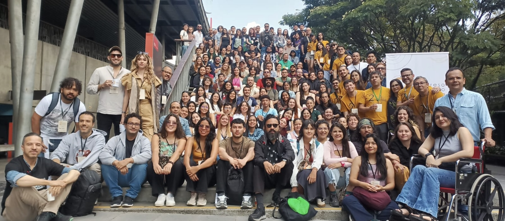

Del 18 al 22 de noviembre de 2024, Medellín fue sede del **2do Congreso Colombiano de Bioacústica y Ecoacústica (2CCBE)**, un evento que marcó un hito en la integración de ciencia, arte y tecnología para el estudio de los paisajes sonoros y la biodiversidad. Realizado en el icónico **Parque Explora** y organizado en colaboración con la **Universidad de Antioquia**, el **Instituto Tecnológico Metropolitano (ITM)** y el mismo Parque Explora, el congreso atrajo a académicos, profesionales y estudiantes de diversas partes del mundo, consolidándose como un referente internacional en el campo de la bioacústica y la ecoacústica.

#### **Actividades Pre-Congreso: Un Éxito Formativo**

Previo al congreso, se llevaron a cabo cursos y talleres especializados que sumaron **126 inscripciones**, abordando temáticas innovadoras como la **ecología del paisaje** con énfasis en ecoacústica, la **morfometría geométrica** como herramienta en el estudio de la bioacústica y la introducción al uso de **machine learning** para la detección automática de cantos. También se realizaron talleres prácticos e interactivos, como el taller bioacústico de creación audioreactiva, el ejercicio **Teléfono roto con la biodiversidad** y un curso sobre grabaciones acústicas en ambientes acuáticos. Además, el webinar **La Ecoacústica y el Licenciamiento Ambiental en Colombia** reunió a expertos para discutir aplicaciones prácticas en el contexto nacional.

#### **Conferencias Magistrales**

El congreso ofreció un programa de charlas magistrales de altísimo nivel, impartidas por destacados investigadores internacionales que abordaron temas innovadores y fundamentales en la ecoacústica. **Rex Crocroft** exploró la ecología acústica de las interacciones planta-insecto, mientras que **Fernando Vargas-Salinas** analizó cómo el ruido abiótico influye en las señales acústicas de ranas y sapos. **Danny Zurc** mostró cómo la bioacústica puede usarse para el desarrollo de obras artísticas y experiencias sensoriales. **Marcelo Araya-Salas** presentó un estudio sobre la evolución cultural del canto de un colibrí, **Monica Retamosa** compartió su experiencia incorporando la ecoacústica en proyectos de monitoreo en Costa Rica, **Gloriana Chaverri** profundizó en las interacciones acústicas y la cohesión social en murciélagos. Por su parte, **Karan Odom** destacó el canto femenino en aves como una herramienta clave para comprender los misterios de la naturaleza.

#### **Impacto internacional y participación diversa**

El congreso reunió a **168 asistentes** provenientes de **16 países**, entre ellos México, Costa Rica, Perú, Paraguay, Argentina, Ecuador, Canadá y Estados Unidos. Participaron **38 universidades** (23 colombianas y 15 internacionales), reflejando una amplia representación académica. Durante los días del evento, se presentaron **84 ponencias y 52 pósters**, que abordaron investigaciones de frontera en la bioacústica del neotrópico.

Los asistentes se dividieron en una comunidad diversa y equilibrada: **38% estudiantes de pregrado**, **40% profesionales**, y **22% estudiantes de posgrado**.

#### **Actividades de Divulgación: Ciencia para Todos**

En alianza con el **Parque Explora**, se realizaron **7 eventos de divulgación científica** durante el congreso, integrando arte, tecnología y biodiversidad. Entre las actividades destacaron la improvisación subacuática _“Primero estaba el Mar”_ de **Alejandro Bernal**, la exploración artística y experimental de la naturaleza con **Jorge Barco** en _“Resonancias”_, y la charla de **Fernando Vargas Salinas** sobre las fascinantes estrategias reproductivas de las ranas colombianas titulada [_“Ranas de Colombia: serenatas, cortejos con brincos, machos nodriza y otras historias de cómo se reproducen y cuidan sus huevos”_](https://www.youtube.com/watch?v=K_ToJb5HxQs). También se presentó la conversación y viaje sonoro [_“¿A qué suenan los bosques?”_](https://www.youtube.com/watch?v=bga80AXHpgU), a cargo de Danny Zurc y Juan Felipe Zapata, que exploró paisajes acústicos desde el páramo hasta el mar, y el performance audio-reactivo _“Aleteo y coleteo”_ de Ecosound Systema. Estas actividades atrajeron a **837 asistentes presenciales** y más de **5 mil participantes virtuales**, fortaleciendo el impacto del evento en la comunidad local e internacional.

El Congreso Internacional de Ecoacústica 2024 no solo superó las expectativas en términos de participación e impacto académico, sino que también se consolidó como un espacio de conexión interdisciplinaria. Este éxito es testimonio del compromiso de Medellín y sus instituciones con el avance científico y la conservación de la biodiversidad. Sin duda, un evento que marcará el rumbo de la bioacústica y la ecoacústica en los años venideros.